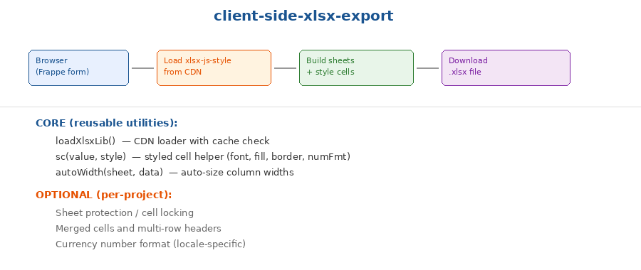

# Client-Side XLSX Export

Utility functions for generating styled Excel workbooks directly in the browser from a Frappe Client Script or Custom HTML Block. Uses the `xlsx-js-style` CDN library — no server-side code needed.



## When to use

- You need to export a styled Excel file from a Frappe form or dashboard
- The data is already available client-side (DOM tables, JavaScript arrays)
- You need formatting: merged cells, colored headers, currency formats, borders
- The target environment has internet access (for CDN), or you can self-host the library

## The problem

Frappe's built-in `frappe.tools.downloadify` produces basic CSV-like exports. When stakeholders need formatted Excel workbooks — with branded headers, merged cells, number formats, and multiple sheets — you need a richer library. But loading heavy dependencies in a Client Script needs careful handling (cache-check, async load, error fallback).

## Core vs Optional

**CORE** (reusable utilities — copy these):
- `loadXlsxLib()` — CDN loader with cache check; resolves immediately if already loaded
- `sc(value, styleOpts)` — Styled cell helper; creates `{v, t, s}` cell objects with font, fill, border, numFmt
- `autoWidth(sheet, data)` — Auto-sizes column widths based on content length

**OPTIONAL** (per-project customisation):
- Sheet protection / cell locking (use `sheet['!protect']` with password)
- Merged cells and multi-row headers (use `sheet['!merges']`)
- Currency number format locale (e.g., `_(₹* #,##0.00_)` for INR)
- Indian number formatting

## Quick start

```javascript
// 1. Load the library (cached after first call)
await loadXlsxLib();

// 2. Build your data as a 2D array
var data = [
  [sc('Name', {font: {bold: true}, fill: 'E6E6E6'}), sc('Amount', {font: {bold: true}, fill: 'E6E6E6'})],
  [sc('Health Camps'), sc(50000, {numFmt: '#,##0'})],
  [sc('Poultry'), sc(75000, {numFmt: '#,##0'})]
];

// 3. Create sheet and workbook
var ws = XLSX.utils.aoa_to_sheet(data);
autoWidth(ws, data);
var wb = XLSX.utils.book_new();
XLSX.utils.book_append_sheet(wb, ws, 'Budget');

// 4. Download
XLSX.writeFile(wb, 'budget.xlsx');
```

## API

### `loadXlsxLib()`

Returns a `Promise` that resolves when the XLSX library is ready. Safe to call multiple times — uses cache check.

### `sc(value, options)`

Creates a styled cell object for `xlsx-js-style`.

| Option | Type | Description |
|--------|------|-------------|
| `font` | Object | `{name, sz, bold, color: {rgb}}` |
| `fill` | string | Background color as hex (e.g., `'FFCB05'`) |
| `alignment` | Object | `{horizontal, vertical, wrapText}` |
| `border` | Object/false | Border config, or `false` for no borders |
| `numFmt` | string | Number format string (e.g., `'#,##0'`, `'0.00%'`) |

### `autoWidth(sheet, data)`

Sets `sheet['!cols']` based on maximum content width per column.

| Parameter | Type | Description |
|-----------|------|-------------|
| `sheet` | Object | XLSX worksheet object |
| `data` | Array[] | The 2D data array used to create the sheet |

## CDN URL

```
https://cdn.jsdelivr.net/npm/xlsx-js-style@1.2.0/dist/xlsx.bundle.js
```

For air-gapped environments, download this file and host it on your Frappe instance's `public/` directory.

## Works in

Client Scripts, Custom HTML Blocks, Frappe Pages — any browser context where you can load a script tag.

## Origin

Extracted from the LIC HFL Budget Allocation feature, which generates a 3-sheet styled Excel workbook matching the LIC HFL budget format — with colour-coded headers, INR currency formatting, merged cells, and sheet protection.
