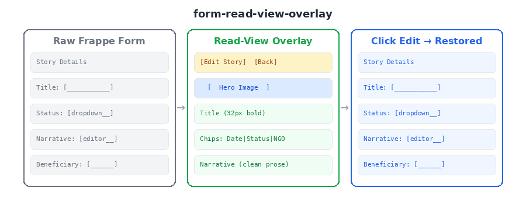

# Form Read-View Overlay

Renders a clean "presentation mode" overlay on a Frappe form tab, hiding all form sections and providing an Edit button to restore the standard form. The overlay content is fully customisable via a render function — you supply the HTML, the pattern handles the tab mechanics.



## When to use

- Non-technical users (comms team, donors, managers) need to **view** content without seeing the raw form
- You want a "magazine article" or "report card" view on top of a standard DocType form
- The form has a natural split between "viewing" and "editing" — stories, case studies, proposals, reports
- You need an Edit button that seamlessly drops back to the standard form

## The problem

Frappe forms always show the raw form layout — field labels, input controls, section breaks. For content-heavy DocTypes (stories, reports, case studies), this is ugly and confusing for non-technical users. There's no built-in "read mode" that renders the content as a clean layout.

Building an overlay manually requires knowing how to:
1. Find the correct tab wrapper in v16 (see `frappe-tab-wrapper-access`)
2. Hide **all** form children (not just `.frappe-control` — sections use `.form-section.card-section`)
3. Inject custom HTML and wire up edit/back buttons
4. Restore the form cleanly when the user wants to edit

## How it works

`buildReadViewOverlay(frm, options)` does all the plumbing:
1. Finds the tab via `getTabWrapper()` (v16-safe)
2. Removes any previous overlay (idempotent on refresh)
3. Hides all `$tab.children()` (form sections, controls, dashboard)
4. Prepends the overlay HTML (toolbar + your content from `renderContent`)
5. Wires up Edit button (removes overlay, shows children)
6. Wires up Back button (navigates to `backUrl`)

You only write the `renderContent(frm)` function — the rest is handled.

## Core vs Optional

**CORE** (copy this):
- `buildReadViewOverlay()` — tab discovery, children hide/show, overlay inject, button wiring
- `getTabWrapper()` — inlined from the tab-wrapper-access pattern

**OPTIONAL** (you write this per-project):
- `renderContent(frm)` — the specific HTML layout (article, dashboard card, report view)
- `renderCSS()` — project-specific styles
- Button labels, colors, back URL

## Quick start

```javascript
frappe.ui.form.on('My DocType', {
  refresh: function(frm) {
    if (frm.is_new()) return;
    setTimeout(function() {
      buildReadViewOverlay(frm, {
        tabFieldname: 'tab_details',
        editLabel: 'Edit Record',
        backUrl: '/app/my-doctype',
        renderContent: function(frm) {
          return '<div style="max-width:800px;margin:0 auto;padding:20px;">' +
            '<h1>' + (frm.doc.title || 'Untitled') + '</h1>' +
            '<p>' + (frm.doc.description || '') + '</p>' +
            '</div>';
        }
      });
    }, 100);
  }
});
```

## API

### `buildReadViewOverlay(frm, options)`

| Parameter | Type | Description |
|-----------|------|-------------|
| `frm` | Object | The Frappe form object (`cur_frm`) |
| `options.tabFieldname` | string | Tab Break fieldname to target |
| `options.renderContent` | Function | `(frm) => string` — returns HTML for the overlay body |
| `options.renderCSS` | Function | `() => string` — returns CSS rules (optional) |
| `options.overlayClass` | string | CSS class for the overlay wrapper (default: `'rv-overlay'`) |
| `options.editLabel` | string | Edit button label (default: `'Edit'`) |
| `options.backLabel` | string | Back button label (default: `'Back'`) |
| `options.backUrl` | string | URL for back button (omit to hide) |
| `options.editColor` | string | Edit button hex color (default: `'#B45309'`) |
| `options.onEdit` | Function | Callback after form is restored |
| **Returns** | boolean | `true` if rendered, `false` if tab not found |

## Depends on

- [frappe-tab-wrapper-access](../frappe-tab-wrapper-access/) — inlined in the utility for zero-dependency usage

## Works in

Client Scripts on any DocType with Tab Break fields.

## Origin

Extracted from the Stories of Change feature (`mgrant-stories-of-change`), where the comms team needed to view stories as clean articles rather than raw Frappe forms. The overlay pattern was generalised from the `story-of-change-read-view.js` Client Script, where hiding `$tab.children()` (not just `.frappe-control`) was the key insight for cleanly suppressing all form sections.
