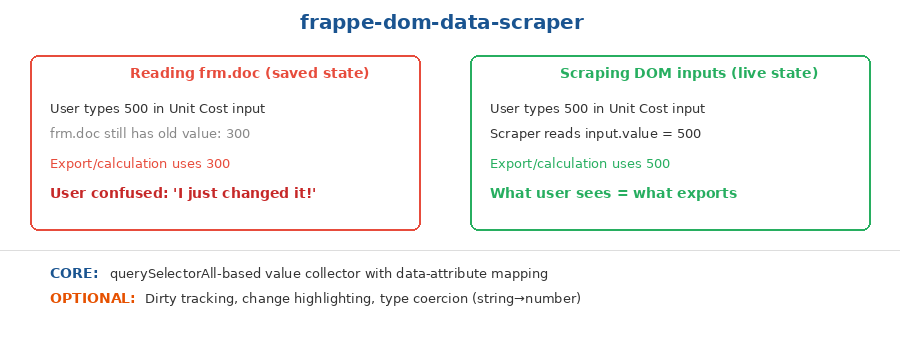

# Frappe DOM Data Scraper

Reads live input values directly from the DOM instead of relying on `frm.doc`, which may contain stale data when the user has edited a custom-rendered UI without triggering Frappe's built-in change handlers.



## When to use

- You render custom `<input>` fields inside an HTML-type field on a Frappe form
- Users edit values in your custom UI, but those edits don't automatically sync to `frm.doc`
- You need to export, calculate, or save the **current visible values** — not the last-saved state
- You're building an Excel export, a save function, or a total calculation for a custom table

## The problem

When you render custom HTML inputs inside a Frappe HTML field (not standard Frappe fields), user edits to those inputs don't update `frm.doc`. The form object only knows about standard Frappe fields. So if a user types "500" in your custom input but the last saved value was "300", reading `frm.doc` gives you 300 — not what the user sees.

This causes a confusing UX: the user edits a value, clicks "Download", and gets an Excel file with the old value.

## How it works

Instead of reading from `frm.doc`, scrape values directly from the DOM using `querySelectorAll` with data attributes that identify each cell's position (row index, quarter, fund source, etc.).

## Core vs Optional

**CORE** (copy this):
- `querySelectorAll`-based value collector with data-attribute mapping
- Returns a structured object keyed by row/column identifiers

**OPTIONAL** (add if needed):
- Dirty tracking (highlight cells that changed since last save)
- Change highlighting (visual indicator on modified cells)
- Type coercion (string→number, with NaN handling)

## Quick start

```javascript
// Your custom inputs use data attributes:
// <input class="my-input" data-row="0" data-quarter="Q1" data-fund="lic" value="500">

var liveData = scrapeDOMValues('.my-table', '.my-input', ['row', 'quarter', 'fund']);
// Returns: { '0': { 'Q1': { 'lic': 500, ... }, ... }, ... }
```

## API

### `scrapeDOMValues(tableSelector, inputSelector, dataKeys)`

| Parameter | Type | Description |
|-----------|------|-------------|
| `tableSelector` | string | CSS selector for the table container |
| `inputSelector` | string | CSS selector for input elements to scrape |
| `dataKeys` | string[] | Data attribute names to use as keys (e.g., `['row', 'quarter']`) |

Returns a nested object keyed by the data attribute values.

### `scrapeTableRows(tableSelector, rowSelector)`

Simpler variant that scrapes all inputs within each row, returning an array of row objects.

| Parameter | Type | Description |
|-----------|------|-------------|
| `tableSelector` | string | CSS selector for the table |
| `rowSelector` | string | CSS selector for data rows (e.g., `'.data-row'`) |

Returns an array where each element contains all input values for that row.

## Works in

Client Scripts, Custom HTML Blocks — anywhere you render custom `<input>` elements that Frappe doesn't know about.

## Origin

Extracted from the LIC HFL Budget Allocation feature, where a budget table with hundreds of editable input cells needed to export current values to Excel and save to the backend. Reading from `frm.doc` would have returned stale data because the inputs were custom-rendered, not Frappe fields.
