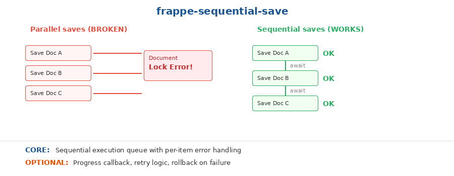

# Frappe Sequential Save

A recursive promise chain that saves multiple Frappe documents one at a time, avoiding the document lock errors that occur when you fire parallel `frappe.call` requests to create/update the same DocType.



## When to use

- You need to save multiple records to the same DocType from a Client Script
- Parallel `frappe.call` requests are hitting "Document has been modified" or lock errors
- You're bulk-saving child table rows, budget line items, or batch-created records
- You want per-item error handling without stopping the entire batch

## The problem

Frappe uses optimistic locking on documents. When you fire multiple `frappe.call('frappe.client.save_doc')` requests in parallel for related documents (or documents that trigger server-side hooks on the same parent), the second request often fails with a `TimestampMismatchError` or document lock conflict. This is especially common when:

- Creating multiple child records under the same parent
- Saving records that trigger `on_update` hooks on a shared parent document
- Bulk-creating records from a client-side grid/table UI

## How it works

Instead of `Promise.all([save1, save2, save3])`, the pattern uses a recursive function that:

1. Saves item at index `i`
2. On success, calls itself with `i + 1`
3. On failure, logs the error and stops (or optionally continues)

This guarantees only one `frappe.call` is in flight at a time.

## Core vs Optional

**CORE** (copy this):
- Sequential execution queue with per-item error handling
- Progress callback so UI can update (e.g., "Saving row 3 of 12...")

**OPTIONAL** (add if needed):
- Retry logic (retry failed saves N times before giving up)
- Rollback on failure (delete already-saved records if one fails)
- Batch size control (save N at a time instead of strictly 1)

## Quick start

```javascript
// items: array of objects to save
// saveFn: function that takes an item and returns a Promise
sequentialSave(items, saveFn, {
  onProgress: function(i, total) {
    frappe.show_alert({ message: 'Saving ' + (i+1) + ' of ' + total, indicator: 'blue' });
  },
  onComplete: function(total) {
    frappe.show_alert({ message: 'Saved ' + total + ' rows', indicator: 'green' });
  },
  onError: function(i, err) {
    frappe.show_alert({ message: 'Error on row ' + (i+1), indicator: 'red' });
  }
});
```

## API

### `sequentialSave(items, saveFn, options)`

| Parameter | Type | Description |
|-----------|------|-------------|
| `items` | Array | Array of items to process |
| `saveFn` | Function | `(item, index) => Promise` — the save operation for one item |
| `options.onProgress` | Function | `(index, total) => void` — called before each save |
| `options.onComplete` | Function | `(total) => void` — called when all items are saved |
| `options.onError` | Function | `(index, error) => void` — called on failure |
| `options.stopOnError` | boolean | If `true` (default), stop on first error. If `false`, skip and continue. |

## Works in

Client Scripts, Custom HTML Blocks, Frappe Pages — anywhere you make `frappe.call` requests.

## Origin

Extracted from the LIC HFL Budget Allocation feature, where saving 20+ Non-Programmatic budget rows in parallel caused Frappe document lock conflicts. Switching to sequential saves eliminated the errors entirely.
