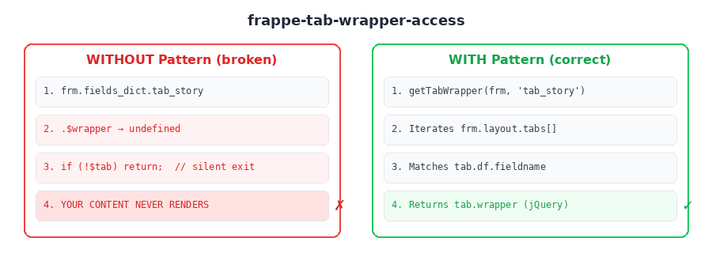

# Frappe Tab Wrapper Access

Safe accessor for Tab Break wrappers in Frappe v16. The commonly expected path `frm.fields_dict.tab_name.$wrapper` is **undefined** in v16 — tabs live under `frm.layout.tabs[]` with a `.wrapper` jQuery property. This pattern provides a clean lookup function with a v15 fallback.



## When to use

- You're writing a Client Script that injects content into a specific tab
- You need to hide/show form sections within a tab
- You're building an overlay or read-view that targets a single tab
- `frm.fields_dict.tab_name` returns `undefined` and you don't know why

## The problem

In Frappe v16, Tab Break fields are not accessible via `frm.fields_dict`. The tab objects exist in `frm.layout.tabs` — an array of tab objects, each with:

- `tab.df.fieldname` — the fieldname from the DocType definition
- `tab.df.label` — the visible tab label
- `tab.wrapper` — a **jQuery object** wrapping the tab's content `<div>`

This is undocumented and causes **silent failures** — your code simply doesn't render, with no error thrown, because the `fields_dict` lookup returns `undefined` and your null-check bails out.

## How it works

`getTabWrapper(frm, fieldname)` iterates `frm.layout.tabs`, matches on `tab.df.fieldname`, and returns the jQuery wrapper. Falls back to `frm.fields_dict` for v15 compatibility.

## Core vs Optional

**CORE** (copy this):
- `getTabWrapper(frm, fieldname)` — single tab lookup with v15 fallback

**OPTIONAL** (add if needed):
- `getAllTabWrappers(frm)` — returns a `{ fieldname: $wrapper }` map of all tabs
- Tab visibility toggling (show/hide tab link + content)

## Quick start

```javascript
// In your Client Script
var $tab = getTabWrapper(frm, 'tab_story');
if (!$tab) return; // tab not found — safe exit

// Now use $tab like any jQuery element
$tab.prepend('<div>My custom content</div>');
$tab.find('.frappe-control').hide();
$tab.children().hide();
```

## API

### `getTabWrapper(frm, tabFieldname)`

| Parameter | Type | Description |
|-----------|------|-------------|
| `frm` | Object | The Frappe form object (`cur_frm`) |
| `tabFieldname` | string | The fieldname of the Tab Break (e.g., `'tab_story'`) |
| **Returns** | jQuery\|null | The tab's jQuery wrapper, or `null` if not found |

### `getAllTabWrappers(frm)`

| Parameter | Type | Description |
|-----------|------|-------------|
| `frm` | Object | The Frappe form object |
| **Returns** | Object | Map of `{ fieldname: $wrapper }` for all tabs |

## Debugging tip

If you're not sure what tab fieldnames exist on a DocType, run this in the browser console:

```javascript
cur_frm.layout.tabs.forEach(function(t) {
  console.log(t.df.fieldname, '→', t.df.label, '| wrapper:', !!t.wrapper);
});
```

## Works in

Client Scripts on any DocType with Tab Break fields. Frappe v16 (primary) and v15 (fallback).

## Origin

Extracted from the Stories of Change read-view feature (`mgrant-stories-of-change`), where `frm.fields_dict.tab_story.$wrapper` silently returned `undefined`, causing the entire read-view overlay to not render. Discovered via live debugging on staging — the fix required switching to `frm.layout.tabs[].wrapper`.
