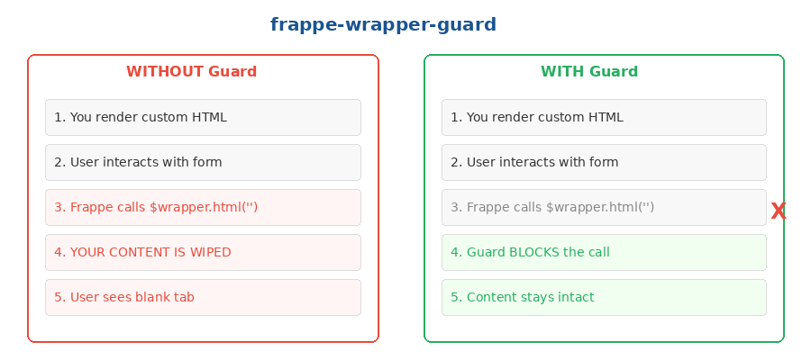

# Frappe Wrapper Guard

Prevents Frappe's form refresh cycle from wiping custom HTML you've rendered into an HTML field. Without this, any form event (`refresh`, `onload`, field change) triggers `$wrapper.html('')`, destroying your UI.



## When to use

- You render a custom UI (table, dashboard, tabs) into an HTML-type field on a Frappe DocType form
- Frappe's refresh cycle keeps blanking your content
- You need your UI to survive form saves, field changes, and background refreshes

## The problem

Frappe's form engine calls `$wrapper.html('')` on HTML fields during refresh events. If you've rendered custom content there, it gets wiped — the user sees a blank tab after saving or navigating.

## How it works

The guard monkey-patches the jQuery `.html()` method on the specific `$wrapper` element. It blocks any external `.html(string)` call (which would overwrite your content) but allows read calls (`.html()` with no args) and your own writes (via a flag).

## Quick start

Copy `wrapper-guard.js` into your Client Script, then call:

```javascript
function setup_my_feature(frm) {
  const $w = frm.fields_dict.my_html_field.$wrapper;
  if (!$w || !$w.length) return;

  // Apply the guard (once)
  wrapperGuard($w);

  // Render your content using the safe render helper
  safeRender($w, frm, '<div>Your custom HTML here</div>');
}
```

## API

### `wrapperGuard($wrapper)`

| Parameter | Type | Description |
|-----------|------|-------------|
| `$wrapper` | jQuery | The `$wrapper` of the HTML field to protect |

Patches `.html()` on the element. Idempotent — safe to call multiple times.

### `safeRender($wrapper, frm, htmlString)`

| Parameter | Type | Description |
|-----------|------|-------------|
| `$wrapper` | jQuery | The guarded wrapper |
| `frm` | Object | The Frappe form object |
| `htmlString` | string | HTML content to render |

Sets the `_ab_self_render` flag, calls `.html()`, then clears the flag. This is the only way to write content past the guard.

## Works in

Client Scripts on any DocType with an HTML field.

## Origin

Extracted from the LIC HFL Budget Allocation feature (`budget_allocation_client_script.js`), where a complex tabbed budget interface rendered into the `cummulative_budget` HTML field needed to survive Frappe's aggressive refresh cycle.
