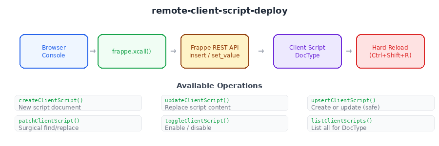

# Remote Client Script Deploy

Create, update, patch, and manage Frappe Client Scripts remotely via `frappe.xcall` — no SSH, no bench, no `developer_mode` required. Essential for managed/hosted Frappe instances where you only have browser console access.



## When to use

- You're deploying Client Scripts to a Frappe instance where `developer_mode` is **off**
- You have no SSH or bench access (managed hosting, client staging servers)
- You're iterating rapidly and need to update scripts without a full deployment cycle
- You want to patch specific lines in an existing script without re-uploading the whole thing
- You need to temporarily toggle scripts on/off for debugging

## The problem

Frappe's standard approach to Client Scripts requires either:
1. Creating them via the UI (Frappe Desk → Client Script list) — tedious for large scripts
2. Using bench commands (`bench --site ... execute`) — requires SSH + `developer_mode`
3. Deploying via app fixtures — requires a full app deployment cycle

When you're building features iteratively on a staging instance with API-only access, none of these work. You need a way to create, update, and patch Client Scripts directly from the browser console or from an AI assistant.

## How it works

All functions use `frappe.xcall` (which wraps `frappe.call` with Promise support) to interact with the Client Script DocType via Frappe's built-in REST API:

- `frappe.client.insert` — create new documents
- `frappe.client.set_value` — update single fields
- `frappe.client.get` — read document data
- `frappe.client.get_list` — list documents with filters

No custom server-side code required — these are standard Frappe APIs available on any instance.

## Core vs Optional

**CORE** (copy this):
- `createClientScript()` — create a new Client Script
- `updateClientScript()` — replace the script content
- `upsertClientScript()` — create-or-update (safe for repeated deploys)
- `toggleClientScript()` — enable/disable
- `listClientScripts()` — list all scripts for a DocType

**OPTIONAL** (add if needed):
- `fetchClientScript()` — read current script content
- `patchClientScript()` — fetch → find/replace → save (surgical updates)
- Chunked upload for large scripts (when browser content filters block large payloads)

## Quick start

```javascript
// In the browser console on your Frappe instance:

// Create or update a Client Script
upsertClientScript({
  name: 'My DocType-Form-my-feature',
  dt: 'My DocType',
  script: 'frappe.ui.form.on("My DocType", { refresh: function(frm) { /* ... */ } });'
}).then(function(doc) {
  console.log('Deployed:', doc.name);
  // IMPORTANT: Hard reload (Ctrl+Shift+R) to pick up the new script
});
```

## API

### `createClientScript(options)`

| Parameter | Type | Description |
|-----------|------|-------------|
| `options.name` | string | Document name (e.g., `'Story of Change-Form-read-view'`) |
| `options.dt` | string | Target DocType |
| `options.script` | string | Full JavaScript content |
| `options.scriptType` | string | `'Form'` or `'List'` (default: `'Form'`) |
| `options.enabled` | boolean | Enable immediately (default: `true`) |

### `updateClientScript(name, script)`

Updates the `script` field of an existing Client Script.

### `upsertClientScript(options)`

Same as `createClientScript` — creates if missing, updates if exists.

### `patchClientScript(name, replacements)`

| Parameter | Type | Description |
|-----------|------|-------------|
| `name` | string | Client Script document name |
| `replacements` | Array | `[{ old: 'find', new: 'replace' }, ...]` |

Fetches current script, applies replacements, saves. Rejects if no replacements match.

### `toggleClientScript(name, enabled)`

Sets `enabled` to `1` or `0`.

### `listClientScripts(dt)`

Returns array of `{ name, enabled, script_type, modified }` for the given DocType.

## Important: Cache behaviour

After creating or updating a Client Script, you **must hard-reload** the page (`Ctrl+Shift+R` / `Cmd+Shift+R`). Frappe caches Client Scripts aggressively — a soft reload or SPA navigation will not pick up changes.

## Works in

Browser console on any Frappe v14/v15/v16 instance. Also works from AI assistants (Claude, etc.) that can execute JavaScript in the browser via automation tools.

## Origin

Extracted from the Stories of Change deployment workflow (`mgrant-stories-of-change`), where all Client Script deployment was done via browser console on a staging instance with `developer_mode` off. The `patchClientScript()` function was born from a real bug fix — updating two lines in a 9KB script without re-uploading the entire thing.
