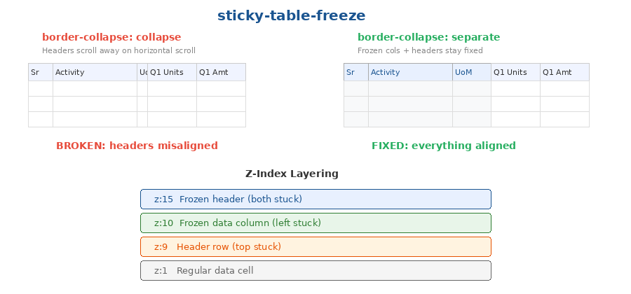

# Sticky Table Freeze

CSS + HTML pattern for freezing both header rows (vertical) and left columns (horizontal) in a scrollable HTML table rendered inside a Frappe form. Pure CSS — no JavaScript scroll listeners.



## When to use

- You render a wide data table inside a Frappe Client Script or Custom HTML Block
- The table has multi-row headers (merged cells spanning quarters/years)
- Users need frozen left columns (like row labels) while scrolling horizontally
- Users need frozen header rows while scrolling vertically

## The problem

CSS `position: sticky` on `<th>` elements breaks silently when the table uses `border-collapse: collapse` — a default in many CSS resets. Headers appear to work but scroll away on horizontal scroll. This is a known browser behaviour that is extremely hard to debug because there's no error — the sticky just silently stops working.

## How it works

Five things must be true for sticky table cells to work:

1. **`border-collapse: separate`** on the `<table>` (with `border-spacing: 0` to keep the visual identical to `collapse`)
2. **`table-layout: fixed`** on the `<table>` — forces browser to respect declared column widths instead of auto-expanding
3. **`position: sticky`** with explicit `top` values on header rows and `left` values on frozen columns
4. **`max-width` matching `width` and `min-width`** on every frozen column — prevents width instability during scroll
5. **Z-index layering** so frozen elements stack correctly:
   - `z-index: 20` — Merged frozen header cells (stuck both top and left, highest priority)
   - `z-index: 15` — Individual frozen header cells
   - `z-index: 10` — Frozen data column cells (stuck left only)
   - `z-index: 9` — Regular header rows (stuck top only)
   - `z-index: 1` — Regular data cells (default)

## Quick start

Copy the CSS from `sticky-table.css` and apply the classes to your table:

```html
<div class="stf-scroll-container">
  <table class="stf-table">
    <thead>
      <tr>
        <th class="stf-frozen" style="left:0;width:40px;min-width:40px;max-width:40px;">Sr</th>
        <th class="stf-frozen" style="left:40px;width:150px;min-width:150px;max-width:150px;">Name</th>
        <th class="stf-frozen stf-frozen-last" style="left:190px;width:80px;min-width:80px;max-width:80px;">Unit Cost</th>
        <th>Q1 Units</th>
        <th>Q1 Amount</th>
      </tr>
    </thead>
    <tbody>
      <tr>
        <td class="stf-frozen" style="left:0;width:40px;min-width:40px;max-width:40px;">1</td>
        <td class="stf-frozen" style="left:40px;width:150px;min-width:150px;max-width:150px;">Activity A</td>
        <td class="stf-frozen stf-frozen-last" style="left:190px;width:80px;min-width:80px;max-width:80px;">50000</td>
        <td>100</td>
        <td>50000</td>
      </tr>
    </tbody>
  </table>
</div>
```

## Critical rules

### Width stability (discovered the hard way)

Every frozen column MUST have all three width properties set to the same value:

```css
style="width:150px; min-width:150px; max-width:150px;"
```

Without `max-width`, the browser auto-expands frozen columns to fill available space when not scrolled, then compresses them when scrolling — causing jarring layout shifts.

### Merged header cells for row 1

For multi-row headers where row 1 spans all frozen columns (e.g., "Activity Details"), use a single `<th colspan="N">` with explicit `left:0`:

```html
<th colspan="5" style="position:sticky; left:0; top:0; z-index:20;">
  Activity Details
</th>
```

Do NOT use individual empty `<th>` cells — they won't freeze horizontally without explicit `left` values, and calculating `left` for each is fragile.

### Scroll container

```css
.stf-scroll-container {
  overflow: auto;          /* BOTH axes — not just overflow-x */
  max-height: 70vh;        /* responsive to viewport, not fixed px */
  -webkit-overflow-scrolling: touch;  /* smooth on iOS */
}
```

Using `overflow-x: auto` alone disables vertical sticky. Must be `overflow: auto`.

### Frozen column separator

Add a visual separator on the last frozen column so users can see the freeze boundary:

```css
.stf-frozen-last {
  border-right: 2px solid #999;
  box-shadow: 2px 0 4px rgba(0,0,0,0.08);
}
```

## Gotchas

### position:sticky vs overflow:hidden

**NEVER** put `overflow: hidden` and `position: sticky` on the same element (e.g., for text truncation on a frozen `<td>`). Sticky wins and overflow is silently ignored — content leaks out of the cell.

**Workaround:** Use native `title` attribute for tooltips, or JavaScript-based positioned tooltips on mouseenter. CSS-only hover-expand inside sticky cells does not work reliably.

### colspan in frozen area

`colspan` on cells within the frozen column range (rows 2+) breaks sticky positioning — the browser can't calculate `left` offsets for merged cells. Only use `colspan` in row 1 where you have a single merged cell with explicit `left:0`.

## Frozen column offsets

Calculate cumulative widths for each frozen column's `left` value:

| Column | Width | Left offset |
|--------|-------|------------|
| Sr | 35px | `left: 0` |
| Activity | 150px | `left: 35px` |
| Task Details | 120px | `left: 185px` |
| UoM | 55px | `left: 305px` |
| Unit Cost | 75px | `left: 360px` |

## Multi-row headers

For tables with 2 header rows, each row needs its own `top` value:

```css
.stf-table thead tr:nth-child(1) th { top: 0; z-index: 11; }
.stf-table thead tr:nth-child(2) th { top: 33px; z-index: 11; }
```

Frozen cells in the header need even higher z-index:

```css
.stf-table thead .stf-frozen { z-index: 20 !important; }
```

## Works in

Client Scripts, Custom HTML Blocks, Frappe Pages — anywhere you render an HTML `<table>` inside a scrollable container.

## Browser support

Tested on Chrome 120+, Firefox 115+, Edge 120+. Works in all modern browsers that support `position: sticky` on table cells with `border-collapse: separate`.

## Origin

Extracted from the LIC HFL Budget Allocation feature (v8c→v9), where a financial budget table with 40+ columns and 5 frozen left columns needed both horizontal and vertical scroll freezing. Multiple iterations were needed to discover the width stability, overflow conflict, and merged header cell techniques documented above.
